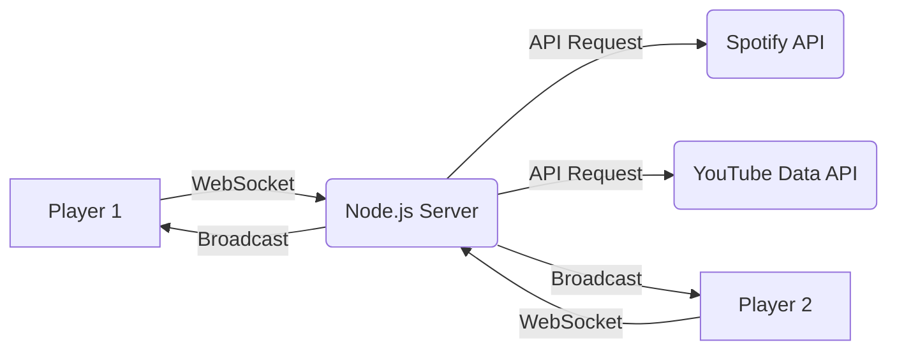

# Developer Documentation — Jaka to Melodia

This document provides a technical overview of the "Jaka to Melodia" (Name That Tune) project, intended for developers who want to understand, maintain, or extend the application.

## Project Overview

"Jaka to Melodia" is a real-time multiplayer music guessing game. Players join rooms, and the host starts rounds based on Spotify or YouTube playlists. The game uses Socket.IO for real-time synchronization and supports two gameplay modes: **Text Mode** and **Buzzer Mode**.

## Architecture

The project follows a classic Client-Server architecture with a React-based frontend and a Node.js/Express backend.

- **Frontend**: Built with React and Vite. It handles the UI, user interactions, audio playback (React-YouTube for YT, HTML Audio for Spotify previews), and real-time state management via `socket.io-client`.
- **Backend**: A Node.js server using Express. It manages game state in-memory (rooms, users, scores), handles API integrations, and orchestrates the game flow using `socket.io`.

## Technology Stack

### Frontend

- **React**: UI framework.
- **Vite**: Build tool and dev server.
- **Socket.IO Client**: Real-time communication.
- **React-YouTube**: YT IFrame API wrapper for playback.
- **Vanilla CSS**: Styling.

### Backend

- **Node.js & Express**: Server framework.
- **Socket.IO**: Real-time bidirectional communication.
- **Axios**: HTTP client for API requests.
- **string-similarity**: Fuzzy matching logic for guesses.
- **nanoid**: Unique room code generation.

## API Integrations

### Spotify

- **Auth**: Uses Client Credentials Flow (cached token).
- **Fetch**: Fetches track details from a playlist URL.
- **Playback**: Uses the `preview_url` (30s snippet) provided by Spotify API.
- **Logic**: [spotify.js](file:///c:/Dev/NodeJs/jaka-to-melodia/server/spotify.js)

### YouTube

- **Auth**: Requires a YouTube Data API v3 Key.
- **Fetch**: Pages through `playlistItems` to get video IDs, then fetches snippets for titles and thumbnails.
- **Playback**: Controlled via the YouTube IFrame Player API.
- **Logic**: [youtube.js](file:///c:/Dev/NodeJs/jaka-to-melodia/server/youtube.js)

## Key Game Logic

### Room Management

Rooms are stored in a `Map` on the server. Each room contains information about the host, connected users, current playlist, logic mode, and scores.

### Guessing & Fuzzy Matching

The application employs robust fuzzy matching to handle typos and variations in track titles:

- **Normalization**: Removes "junk" like (Official Video), [Lyrics], etc.
- **Similarity**: Uses the Dice's Coefficient algorithm via `string-similarity` (threshold ~0.65-0.7).
- **Custom Logic**: Handles cases where the artist's name is part of the YouTube title.
- **Logic**: [utils.js](file:///c:/Dev/NodeJs/jaka-to-melodia/server/utils.js)

### Gameplay Modes

1.  **Text Mode**: Everyone can guess at any time by typing in chat.
2.  **Buzzer Mode**: A player must "buzz" first to lock in their turn. The host then verifies their verbal guess or typed input.

## Environment Variables

| Variable                | Description                 | Source            |
| :---------------------- | :-------------------------- | :---------------- |
| `SPOTIFY_CLIENT_ID`     | Spotify App Client ID       | Spotify Dashboard |
| `SPOTIFY_CLIENT_SECRET` | Spotify App Client Secret   | Spotify Dashboard |
| `YT_API_KEY`            | Google Cloud API Key        | GCP Console       |
| `PORT`                  | Server port (default: 4000) | -                 |

## Setup & Development

### Server

1.  `cd server`
2.  `npm install`
3.  Create `.env` based on `.env.example`.
4.  `npm run dev`

### Client

1.  `cd client`
2.  `npm install`
3.  Create `.env` with `VITE_SERVER_URL=http://localhost:4000`.
4.  `npm run dev`
